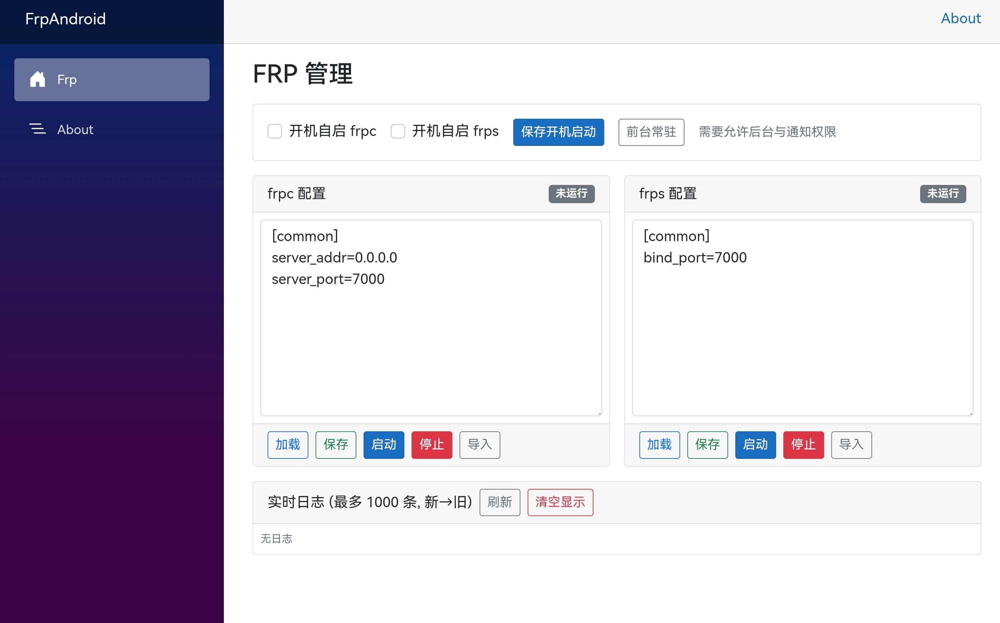

# frp Android 客户端

     

[English](README_en.md) | 中文文档

基于 .NET MAUI 的轻量级 Android 应用，在手机 / 电视盒子上本地运行与管理 frp，支持同时启动 frpc、frps。



## 功能特性

- 一键启动/停止 frpc 与 frps（内置本地二进制，无需额外下载）
- 首次运行自动生成 `frpc.ini` / `frps.ini` 默认配置
- 内置配置文件在线编辑与保存
- 实时日志查看（已过滤 ANSI 颜色/控制字符）
- 前台常驻服务，降低被系统回收概率
- 无需 root，体积小，界面简洁

## 快速开始

1. 安装并打开应用
2. 首次启动会在应用数据目录写入默认 `frpc.ini` / `frps.ini`
3. 在应用内编辑配置（示例：为内网服务做穿透）
4. 分别点击启动 frpc 或 frps，查看实时日志确认状态

停止：点击对应停止按钮；若强制结束应用/系统清理后台，隧道将被关闭。

## 构建说明

环境需求：

- .NET 10+（项目含 `net10.0-android` 目标）
- Android SDK / 构建工具（通过 Visual Studio 或命令行安装）

本地构建（Release 示例）：

```powershell
dotnet build -c Release
```

## 目录概览

```text
src/
  Platforms/Android/        # Android 前台服务、入口 Activity
  Services/                 # 运行管理逻辑
  Resources/Raw/            # 内置 frp 二进制与其它资源
  Components/Pages/         # .NET MAUI / Razor UI
```

## 注意事项

- 默认配置仅示例，请务必根据实际网络与安全需求修改后再暴露服务
- 系统节电/后台限制可能仍导致进程被终止

## 路线 (可能)

- 简易图形化配置向导
- 多配置文件/模板管理
- 后台保活与定时重启

## 许可

本项目使用 Apache License 2.0，参见 `LICENSE.txt`。

## 贡献

欢迎提交 Issue / PR 改进功能或优化体验。

---

frp 项目本身请参阅其上游仓库；本应用仅提供本地运行管理界面。
